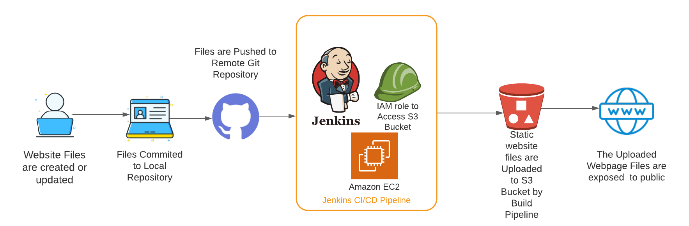
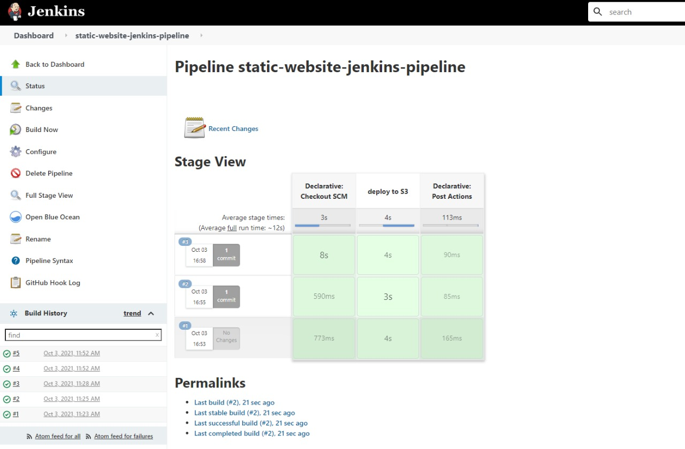

# Deploying a Static Website to AWS S3 using Jenkins Pipeline

# In this project I used the power of jenkins to Deploy a Static website on AWS.
## We use a Git Repository for Version Control of Static HTML files of our Website.
## Whenever We update the files we commit them to the local Git Repository.
## After committing, these files are now pushed to the pre-existing Github Repository so that other developers or programmers can collaborate to work with on same created files in the Github-repo.
## Once the files are pushed, a webhook callback is triggered which in turn trigger a "Release Pipeline" in Jenkins.
## The pipeline will now upload the files to the S3 bucket on AWS.
## IAM credentials will be used by pipeline to authenticate it and upload the files to S3.
## For Every change in the files, The same workflow will be triggered. New updated files are pushed to the Repository and Automatically Updated to S3.
